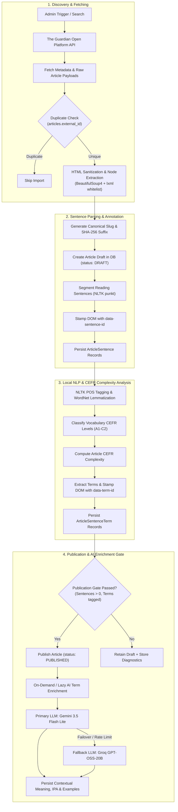
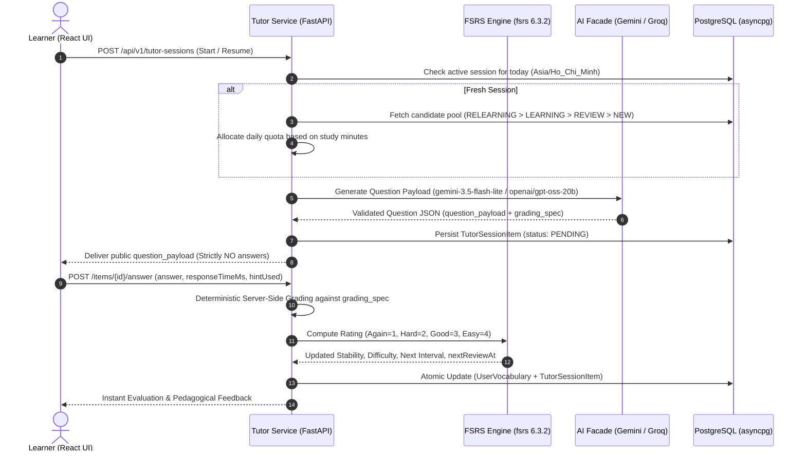
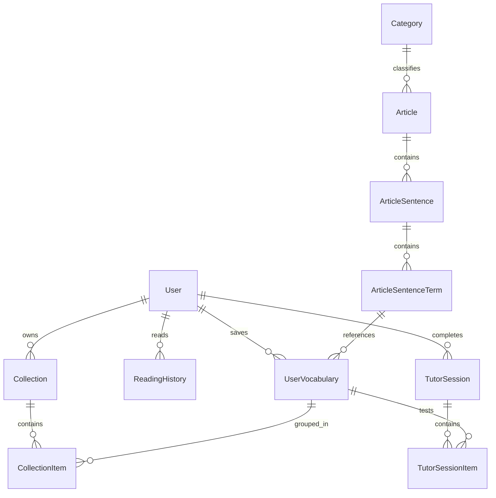

# 📚 Vocab Mate

> **Master English vocabulary in authentic context through real-world news and an adaptive, AI-powered spaced repetition tutor.**

[](vocab-mate-frontend-python/)
[](vocab-mate-backend-python/)
[](https://github.com/open-spaced-repetition/fsrs)
[](https://ai.google.dev/)
[](https://console.groq.com/)
[](docker-compose.yml)
[](#-license)

---

## 📑 Table of Contents

- [Overview](#-overview)
- [System Architecture](#-system-architecture)
- [Key Features](#-key-features)
- [Frontend Application (`vocab-mate-frontend-python`)](#-frontend-application-vocab-mate-frontend-python)
  - [Frontend Architecture & Key Views](#frontend-architecture--key-views)
  - [Frontend Tech Stack & Versions](#frontend-tech-stack--versions)
  - [Frontend Directory Structure](#frontend-directory-structure)
  - [Frontend Local Setup](#frontend-local-setup)
- [Backend Application (`vocab-mate-backend-python`)](#-backend-application-vocab-mate-backend-python)
  - [Backend Architecture & Modules](#backend-architecture--modules)
  - [Backend Tech Stack & Versions](#backend-tech-stack--versions)
  - [Backend Directory Structure](#backend-directory-structure)
  - [Backend Local Setup](#backend-local-setup)
  - [Environment Variables Configuration](#environment-variables-configuration)
  - [API Endpoints & Health Probes](#api-endpoints--health-probes)
- [Core Workflows & Agent Loops](#-core-workflows--agent-loops)
  - [1. News Ingestion & CEFR Linguistic Pipeline](#1-news-ingestion--cefr-linguistic-pipeline)
  - [2. Adaptive AI Tutor Agent & FSRS Spaced Repetition](#2-adaptive-ai-tutor-agent--fsrs-spaced-repetition)
  - [3. Multi-Provider AI Orchestration (`gemini-3.5-flash-lite` + `openai/gpt-oss-20b`)](#3-multi-provider-ai-orchestration)
- [Database Schema & Entity Architecture](#-database-schema--entity-architecture)
- [Trust Boundaries & Security Guardrails](#-trust-boundaries--security-guardrails)
- [Docker Compose Full-Stack Deployment](#-docker-compose-full-stack-deployment)
- [Testing & Quality Assurance](#-testing--quality-assurance)
- [License](#-license)

---

## 🌟 Overview

**Vocab Mate** is an English language learning platform designed around the principle that vocabulary is best learned in context. Traditional flashcard applications isolate vocabulary words from the grammatical structures, stylistic nuances, and collocations in which native speakers express ideas. Vocab Mate bridges this gap by converting authentic, high-caliber news journalism (such as *The Guardian*) into personalized, level-appropriate vocabulary learning.

Learners read authentic journalism, tap unfamiliar words directly within sentences, view contextual definitions and Vietnamese translations, and retain vocabulary through an **adaptive AI Tutor agent** driven by the modern **Free Spaced Repetition Scheduler (FSRS-6.3)** algorithm.

---

## 🏛️ System Architecture

Vocab Mate connects a modern React 19 single-page application with a high-performance asynchronous FastAPI REST backend:

```mermaid
flowchart TD
    subgraph Client_Side["Frontend Client (React 19 + Vite 8)"]
        UI["Web Interface (MUI 9 / Emotion)"]
        Reader["Distraction-Free Article Reader<br/>(CEFR Highlighting & Word Drawer)"]
        TutorUI["Interactive Tutor Session Cards<br/>(MCQ, Cloze, Typed Recall, Micro-Lesson)"]
        AdminStudio["Admin Ingestion & Tiptap Editor"]
        Cache["Client Cache & State<br/>(TanStack Query 5 + Axios Interceptor)"]
        
        UI --> Reader & TutorUI & AdminStudio
        Reader & TutorUI & AdminStudio --> Cache
    end

    subgraph API_Gateway["Backend API (FastAPI + Uvicorn)"]
        GW["REST API Gateway (/api/v1/*)"]
        AuthMiddleware["JWT Authentication + HttpOnly Cookie Refresh"]
        
        Cache -->|HTTPS / REST API| GW
        GW --> AuthMiddleware
        
        subgraph Domain_Services["Domain Feature Services"]
            AuthService["Auth & User Management"]
            ArticleService["Articles & Reading Progress"]
            IngestionService["News Ingestion & HTML Sanitization"]
            TutorService["Tutor Agent Lifecycle & FSRS Scheduling"]
            VocabService["Vocabulary Vault & Collections"]
        end
        
        AuthMiddleware --> Domain_Services
        
        NLP["NLTK Lexical Analyzer<br/>(POS Tagging, Lemmatization, CEFR Classification)"]
        FSRS["FSRS-6.3 Spaced Repetition Engine"]
        AiFacade["AI Multi-Provider Facade<br/>(Gemini 3.5 Flash Lite + Groq GPT-OSS-20B)"]
        
        IngestionService --> NLP
        TutorService --> FSRS & AiFacade
        VocabService --> AiFacade
    end

    subgraph Datastores_and_Providers["External Services & Datastores"]
        Domain_Services -->|asyncpg (AsyncIO)| DB[("PostgreSQL Database<br/>(SQLAlchemy 2.0 AsyncEngine)")]
        AiFacade -->|Primary SDK| Gemini["Google Gemini (gemini-3.5-flash-lite)"]
        AiFacade -->|Failover SDK| Groq["Groq Cloud (openai/gpt-oss-20b)"]
        IngestionService -->|Async HTTPX| Guardian["The Guardian Open Platform API"]
        AuthService -->|Media SDK| Cloudinary["Cloudinary (Avatar Storage)"]
    end
```

---

## ✨ Key Features

- 📰 **Authentic News Reader**: Distraction-free reading experience with backend-sanitized HTML and stable DOM markers (`data-sentence-id`, `data-term-id`).
- 🎯 **Dynamic CEFR Highlighting**: Highlights vocabulary tailored to the user's CEFR proficiency (A1 to C2). Higher-difficulty words are highlighted visually to guide vocabulary acquisition.
- 🔍 **Instant Contextual Word Lookup**: Click any marked word to reveal its IPA pronunciation, Vietnamese meaning specific to the sentence, contextual English definition, part of speech, and usage examples.
- 💾 **Context-Bound Vocabulary Vault**: Words are permanently linked to the exact sentence and article where discovered, organized into custom user collections.
- 🤖 **Adaptive AI Tutor Agent**: Daily personalized review sessions based on the learner's time budget (5, 10, 15, or 20 minutes) and current memory retention state.
- 🧠 **4 Dynamic Question Types**:
  - `NEW` words $\rightarrow$ **Multiple Choice** (4 distinct options A–D).
  - `LEARNING` words $\rightarrow$ **Contextual Cloze** (fill-in-the-blank `___`).
  - `REVIEW` words $\rightarrow$ **Typed Recall** (prompted in Vietnamese, typed in English).
  - `RELEARNING` (lapsed words) $\rightarrow$ **Micro-Lesson Retest** (fascinating real-world mini-stories embedding the target word, followed by instant verification).
- 💡 **Upfront Warmup Trivia Facts**: When reviewing lapsed words, the agent generates captivating real-world trivia facts connecting to the target vocabulary to activate prior memory.
- 📈 **FSRS Spaced Repetition**: Memory stability, difficulty, review intervals, and scheduled due dates are mathematically calculated using `fsrs` (v6.3.2).
- 📊 **Learner Analytics & Streaks**: Real-time tracking of retention rate, FSRS memory distribution, study streaks, and CEFR progress.
- 🛠️ **Admin Ingestion & Publishing Studio**: Search The Guardian API, import articles as drafts, edit content via rich-text Tiptap editor, run automated sentence parsing and CEFR difficulty analysis, and publish live content.

---

## 💻 Frontend Application (`vocab-mate-frontend-python`)

The frontend is a single-page application built on React 19, Vite 8, and Material UI 9.

### Frontend Architecture & Key Views

- **Home Dashboard (`/`)**: Daily study streak overview, retention rates, recent news articles, and quick-launch for daily study sessions.
- **Article Reader (`/articles/:slug`)**: Distraction-free news reading with interactive word tapping, CEFR visual highlights, and contextual term drawer.
- **Adaptive Tutor Session (`/tutor`)**: Interactive review cards supporting 4 pedagogical question modes, hint toggles, response latency timers, and warmup mini-lessons.
- **Vocabulary Vault (`/vocabularies`)**: Repository of saved words categorized by FSRS memory state (`NEW`, `LEARNING`, `REVIEW`, `RELEARNING`) and custom collections.
- **User Profile & Preferences (`/profile`)**: Daily study target selection (5, 10, 15, or 20 minutes), CEFR target adjustment, and Cloudinary avatar uploading.
- **Admin Studio (`/admin`)**: The Guardian API search, batch import, article draft management, rich-text composition with Tiptap, and platform analytics.

### Frontend Tech Stack & Versions

| Package | Exact Version | Description |
| :--- | :--- | :--- |
| **React** | `^19.2.7` | Core UI library for modern component-based architecture |
| **React DOM** | `^19.2.7` | DOM rendering engine for React 19 |
| **Vite** | `^8.1.1` | Next-generation build tool and fast HMR development server |
| **TypeScript** | `~6.0.2` | Static typing across components, hooks, and API schemas |
| **Material UI (MUI)** | `^9.2.0` | Accessible, customizable component design system (`@mui/material`) |
| **Emotion** | `^11.14.0` / `^11.14.1` | CSS-in-JS styling framework (`@emotion/react`, `@emotion/styled`) |
| **TanStack React Query** | `^5.101.4` | Asynchronous server-state management, caching, and deduplication |
| **Tiptap Editor** | `^3.28.0` | Headless rich-text editor for administrative article editing |
| **Axios** | `^1.18.1` | HTTP client with automatic silent JWT refresh retry interceptor |
| **React Router DOM** | `^7.18.1` | Declarative routing with nested routes and role-based guards |
| **React Hook Form** | `^7.82.0` | High-performance, schema-validated forms |
| **Zod** | `^4.4.3` | TypeScript-first schema declaration and runtime validation |
| **i18next** | `^26.3.6` | Internationalization framework |
| **react-i18next** | `^17.0.11` | React integration for multilingual support (Vietnamese & English) |
| **Vitest** | `^4.1.10` | Vite-native unit and component testing framework |
| **ESLint** | `^10.6.0` | Static code analysis and linting |

### Frontend Directory Structure

```text
vocab-mate-frontend-python/
├── src/
│   ├── api/                   # Typed API service clients (Auth, Articles, Tutor, Vocab, Admin)
│   ├── components/            # Reusable UI components (Navbar, WordDrawer, Cards, Buttons)
│   ├── contexts/              # React context providers (AuthContext, ThemeContext)
│   ├── hooks/                 # Custom React hooks (useAuth, useArticle, useTutor)
│   ├── i18n/                  # Localization translation dictionaries (en, vi)
│   ├── pages/                 # Route page components
│   │   ├── Admin/             # Article ingestion, publishing gate, platform analytics
│   │   ├── Article/           # Article reader with CEFR highlight rendering
│   │   ├── Auth/              # Login and registration forms
│   │   ├── Home/              # Dashboard with streaks and recommended reads
│   │   ├── Onboarding/        # Initial CEFR level & study target setup
│   │   ├── Tutor/             # Interactive 4-mode adaptive tutor session cards
│   │   ├── User/              # Account settings, profile, avatar management
│   │   └── Vocabulary/        # Saved words vault and collection deck managers
│   ├── routes/                # Route definitions with ProtectedRoute & AdminRoute guards
│   ├── schemas/               # Zod validation schemas for forms and API responses
│   ├── theme.ts               # Custom Material UI theme configuration & color tokens
│   ├── types/                 # TypeScript interfaces and type definitions
│   └── App.tsx                # Application root with providers and router
├── Dockerfile                 # Multi-stage build (Node builder -> Nginx alpine)
├── nginx.conf                 # Production Nginx reverse-proxy & SPA fallback routing
├── package.json               # Dependencies and npm scripts
└── vite.config.ts             # Vite configuration with React plugin and path aliases
```

### Frontend Local Setup

```bash
# 1. Navigate to the frontend directory
cd vocab-mate-frontend-python

# 2. Install dependencies
npm install

# 3. Configure environment variables
cp .env.example .env
```

Ensure `.env` contains:

```ini
VITE_API_BASE_URL=http://localhost:3000/api/v1
```

Start the Vite development server:

```bash
npm run dev
```

The frontend client will be accessible at: `http://localhost:5173`.

---

## ⚙️ Backend Application (`vocab-mate-backend-python`)

The backend is an asynchronous REST API server built with FastAPI, SQLAlchemy 2.0 (AsyncIO), and PostgreSQL.

### Backend Architecture & Modules

The backend is structured into domain feature modules:

- **`auth`**: User registration, login, silent token refresh with HttpOnly cookies, and password hashing.
- **`users`**: Account management, CEFR proficiency levels, daily study targets, and Cloudinary avatar integration.
- **`articles`**: Published article feeds, reader view with parsed sentence markup, and category filters.
- **`news_ingestion`**: Guardian API client, HTML sanitization via `BeautifulSoup4`/`lxml`, and draft creation.
- **`vocabularies`**: Saved vocabulary storage, contextual snapshots, and lazy AI term enrichment.
- **`collections`**: Custom flashcard deck organization.
- **`reading`**: Reading progress tracking, scroll depth percentage, reading duration, and WPM calculation.
- **`tutor`**: Daily session budgeting, priority candidate selection, dynamic AI question dispatch, deterministic grading, and FSRS memory state updates.
- **`analytics`**: Learner retention statistics, study streak calendars, and platform-wide admin metrics.
- **`health`**: Kubernetes/Docker `/health/live` and `/health/ready` probe endpoints.
- **`ai`**: Multi-provider facade coordinating Google Gemini (`gemini-3.5-flash-lite`) and Groq (`openai/gpt-oss-20b`).

### Backend Tech Stack & Versions

| Package | Exact Version | Description |
| :--- | :--- | :--- |
| **Python** | `>=3.12` | Asynchronous Python runtime |
| **FastAPI** | `>=0.141.1` | High-performance asynchronous REST API framework |
| **Uvicorn** | `>=0.53.0` | High-throughput ASGI server with standard worker support |
| **SQLAlchemy** | `>=2.0.52` | Async ORM and SQL toolkit (`sqlalchemy[asyncio]`) |
| **asyncpg** | `>=0.31.0` | Asynchronous PostgreSQL database driver |
| **Alembic** | `>=1.20.0` | Database schema migrations management |
| **Pydantic v2** | `>=2.13.5` | Data validation and serialization via Python type hints |
| **Pydantic Settings**| `>=2.15.0` | Application configuration management loaded from `.env` |
| **fsrs** | `>=6.3.2` | Free Spaced Repetition Scheduler algorithm |
| **NLTK** | `>=3.10.3` | Natural Language Toolkit for sentence tokenization, POS tagging, and WordNet |
| **google-genai** | `>=2.23.0` | Official Google GenAI SDK for `gemini-3.5-flash-lite` |
| **groq** | `>=1.7.0` | Official Groq async SDK for `openai/gpt-oss-20b` fallback |
| **BeautifulSoup4** | `>=4.15.0` | Robust HTML parsing and sanitization filter |
| **lxml** | `>=6.1.3` | High-performance C-based XML and HTML parser |
| **HTTPX** | `>=0.28.1` | Asynchronous HTTP client for Guardian news API requests |
| **PyJWT** | `>=2.14.0` | Cryptographic JSON Web Token encoding and verification |
| **pwdlib[bcrypt]** | `>=0.3.1` | Password hashing library |
| **bcrypt** | `>=5.0.0` | Cryptographic password hashing engine |
| **Cloudinary** | `>=1.46.2` | Cloud storage for user profile avatar uploads |
| **uv** | `Latest` | Astral's package manager and environment resolver |
| **Ruff** | `>=0.16.7` | Fast Python linter and code formatter written in Rust |
| **pytest** | `>=9.1.1` | Test framework |
| **pytest-asyncio** | `>=1.4.0` | Asyncio extension for pytest |

### Backend Directory Structure

```text
vocab-mate-backend-python/
├── alembic/                    # Database migration environment and revision scripts
│   ├── versions/               # Schema revisions (2fe341dff1b3_initial_schema.py, etc.)
│   └── env.py                  # Alembic async migration runner
├── app/
│   ├── common/                 # Shared dependencies (DbSession, CurrentUser), custom exceptions, responses
│   ├── core/                   # Configuration (config.py), database engine (database.py), security (security.py)
│   ├── models/                 # SQLAlchemy 2.0 ORM models (users, articles, tutor, vocabularies, etc.)
│   ├── modules/                # Feature-based business logic (ai, tutor, articles, reading, etc.)
│   └── main.py                 # FastAPI application factory, middleware, and route registry
├── tests/                      # Pytest async test suite
├── Dockerfile                  # Multi-stage production container with uv and non-root appuser
├── docker-compose.yml          # Container orchestration (Backend + Frontend)
├── entrypoint.sh               # Container startup script (runs alembic upgrade & starts uvicorn)
├── pyproject.toml              # Dependencies and tool configurations
└── uv.lock                     # Pinned deterministic dependency lockfile
```

### Backend Local Setup

```bash
# 1. Navigate to the backend directory
cd vocab-mate-backend-python

# 2. Install dependencies into virtual environment using uv
uv sync

# 3. Configure environment variables
cp .env.example .env
```

Download required NLTK datasets:

```bash
uv run python -m nltk.downloader punkt punkt_tab averaged_perceptron_tagger averaged_perceptron_tagger_eng wordnet
```

Apply database migrations:

```bash
uv run alembic upgrade head
```

Start the backend development server:

```bash
uv run uvicorn app.main:app --reload --port 3000
```

The API server will listen on `http://localhost:3000`.  
Interactive documentation: `http://localhost:3000/api/docs`.

---

### Environment Variables Configuration

| Variable | Type | Default | Description |
| :--- | :--- | :--- | :--- |
| `PORT` | `int` | `3000` | Port on which the API server listens |
| `HOST` | `str` | `0.0.0.0` | Host interface address |
| `ENVIRONMENT` | `str` | `development` | Environment mode (`development` / `production`) |
| `DATABASE_URL` | `str` | *Required* | PostgreSQL connection string (`postgresql+asyncpg://...`) |
| `DIRECT_URL` | `str` | *Optional* | Direct connection string for pooling gateways |
| `JWT_ACCESS_SECRET`| `str` | *Required* | Secret key for signing access tokens (min. 32 chars) |
| `JWT_ACCESS_EXPIRES_IN`| `int` | `900` | Access token lifespan in seconds (15 minutes) |
| `JWT_REFRESH_SECRET`| `str` | *Required* | Secret key for signing refresh tokens |
| `JWT_REFRESH_EXPIRES_IN`| `int` | `604800` | Refresh token lifespan in seconds (7 days) |
| `BCRYPT_ROUNDS` | `int` | `12` | Cost factor for password hashing |
| `CORS_ORIGIN` | `str` | `http://localhost:5173,...` | Allowed CORS client origins |
| `COOKIE_SECURE` | `bool`| `false` | Enforces HTTPS-only cookies (set `true` in production) |
| `COOKIE_SAME_SITE` | `str` | `lax` | Cookie SameSite attribute (`lax`, `strict`, `none`) |
| `ANALYTICS_TIMEZONE` | `str` | `Asia/Ho_Chi_Minh` | Timezone used for daily session bounds and streaks |
| `GEMINI_API_KEY` | `str` | *Required* | Google AI Studio API key |
| `GEMINI_MODEL` | `str` | `gemini-3.5-flash-lite` | Primary AI model identifier |
| `GROQ_API_KEY` | `str` | *Required* | Groq Cloud API key |
| `GROQ_MODEL` | `str` | `openai/gpt-oss-20b`| Fallback AI model identifier |
| `AI_REQUEST_TIMEOUT_MS`| `int` | `30000` | AI generation timeout in milliseconds |
| `GUARDIAN_API_KEY`| `str` | *Required* | The Guardian Open Platform API key |
| `CLOUDINARY_CLOUD_NAME`| `str` | *Optional* | Cloudinary cloud name for avatar storage |
| `CLOUDINARY_API_KEY` | `str` | *Optional* | Cloudinary API key |
| `CLOUDINARY_API_SECRET`| `str` | *Optional* | Cloudinary API secret |

---

### API Endpoints & Health Probes

```text
/api/v1/
├── auth/
│   ├── POST   /register          # Register learner account
│   ├── POST   /login             # Authenticate credentials & set HttpOnly refresh cookie
│   ├── POST   /refresh           # Silent token rotation
│   └── POST   /logout            # Invalidate session & clear cookies
├── users/
│   ├── GET    /me                # Get current profile & study goals
│   ├── PATCH  /me                # Update name, dailyStudyMinutes, CEFR level
│   ├── POST   /me/avatar         # Upload avatar to Cloudinary
│   └── PATCH  /me/password       # Change account password
├── articles/
│   ├── GET    /                  # Browse published articles (query, category, CEFR)
│   └── GET    /{slug}            # Retrieve full article with marked sentences & terms
├── reading/
│   ├── POST   /{article_id}/start# Initiate or resume reading session
│   └── PATCH  /{article_id}/progress # Update scroll depth (%), time, and WPM
├── vocabularies/
│   ├── GET    /                  # List user-saved vocabulary with FSRS states
│   ├── POST   /                  # Save new vocabulary term in sentence context
│   ├── POST   /enrich            # On-demand AI enrichment (IPA, contextual Vietnamese, examples)
│   └── DELETE /{id}              # Remove saved vocabulary item
├── collections/
│   ├── GET    /                  # List user collections/decks
│   ├── POST   /                  # Create collection
│   ├── POST   /{id}/items        # Add vocabulary item to collection
│   └── DELETE /{id}/items/{item_id} # Remove vocabulary item from collection
├── tutor-sessions/
│   ├── POST   /                  # Start or resume today's adaptive tutor session
│   ├── GET    /current           # Fetch current pending activity
│   ├── POST   /items/{id}/answer # Submit answer for deterministic grading & FSRS update
│   └── GET    /summary           # Retrieve daily session summary statistics
├── analytics/
│   └── GET    /stats             # Learner retention rate, streaks, and memory matrix
└── admin/
    ├── articles/                 # Admin CRUD, drafts, publishing gate, CEFR re-analysis
    ├── categories/               # Admin category management
    ├── news/                     # Guardian API search and draft import
    ├── users/                    # Admin user role assignment and account deactivation
    └── analytics/                # Platform-wide usage and engagement metrics
```

#### Health Probes

| Method | Endpoint | Description | Sample Output |
| :--- | :--- | :--- | :--- |
| `GET` | `/health/live` | **Liveness Probe**: Confirms HTTP server process is alive. | `{"status": "ok"}` |
| `GET` | `/health/ready` | **Readiness Probe**: Verifies active PostgreSQL database connectivity (`SELECT 1`). | `{"status": "ok", "database": "connected"}` |
| `GET` | `/` | **Root Descriptor**: Service name, version, and documentation link. | `{"name": "Vocab Mate API (Python)", "version": "1.0.0", "docs": "/api/docs"}` |

---

## 🔄 Core Workflows & Agent Loops

### 1. News Ingestion & CEFR Linguistic Pipeline



### 2. Adaptive AI Tutor Agent & FSRS Spaced Repetition



#### Key Agent Invariants

1. **Deterministic Grading Guardrail**: LLMs **never** evaluate user submissions. Answers are graded deterministically on the backend via whitespace-trimmed and lowercased string matching.
2. **Asymmetric Data Delivery**: `question_payload` contains only the prompt, options, or sentence blank. `grading_spec` (correct answers, explanations) remains private on the server until the item is evaluated.
3. **FSRS-6 Multi-Factor Rating Policy**:
   - **`Again` (1)**: Incorrect answer. Reschedules item for rapid relearning.
   - **`Hard` (2)**: Correct response, but required a hint, took $\ge 30\text{s}$, or was a Multiple Choice recognition question.
   - **`Good` (3)**: Accurate recall under normal pacing without hints.
   - **`Easy` (4)**: Instantaneous typed recall ($< 5\text{s}$) on an established word reviewed at least 3 times.

### 3. Multi-Provider AI Orchestration

```mermaid
flowchart TD
    Req["AI Generation Request<br/>(Enrichment / Question / Warmup)"] --> Val["Input Pydantic Validation"]
    Val --> Format["Format Bounded Prompt & Strict JSON Schema"]
    
    Format --> Primary["Primary Provider: Google Gemini<br/>Model: gemini-3.5-flash-lite"]
    
    Primary -->|Success| OutputCheck["Validate Output against Schema"]
    
    Primary -->|Timeout (408) / Rate-Limit (429) / 5xx| Failover{"Failover Eligible?"}
    
    Failover -- "Yes" --> Fallback["Fallback Provider: Groq Cloud<br/>Model: openai/gpt-oss-20b"]
    Failover -- "No" --> Err["Raise AiError / HTTP 503"]
    
    Fallback -->|Success| OutputCheck
    Fallback -->|Failure| Err
    
    OutputCheck --> Success["Return Structured Typed Result"]
```

- **Primary Provider**: **Google Gemini (`gemini-3.5-flash-lite`)** via the official `google-genai` SDK. Utilizes `ThinkingConfig(thinking_level="MINIMAL")` to ensure low latency and eliminate token overhead.
- **Fallback Provider**: **Groq Cloud (`openai/gpt-oss-20b`)** via the async `groq` SDK. Automated schema normalization (`_normalize_groq_schema`) strips unsupported constraints to ensure seamless strict-schema execution.

---

## 🗄️ Database Schema & Entity Architecture

Vocab Mate uses PostgreSQL with normalized relational models, cascading foreign keys, and composite indexes designed for efficient reads:



---

## 🔒 Trust Boundaries & Security Guardrails

1. **Authentication Token Lifecycle**:
   - Access tokens are short-lived (15 minutes) and kept **in-memory only** by the client (never in `localStorage`).
   - Refresh tokens (7 days) are handled via an **`HttpOnly`, `SameSite=Lax`, `Secure`** cookie, completely inaccessible to JavaScript.
   - Axios request interceptors automatically refresh expired tokens concurrently, queuing in-flight requests and retrying failed calls exactly once.
2. **Zero-Trust AI Guardrails**:
   - LLMs are treated as untrusted data generators.
   - All AI responses are validated through strict **Pydantic schemas** before database persistence.
   - Prompts include explicit boundary instructions preventing prompt injection from article texts.
   - AI outputs never determine authorization, scores, user roles, or grading correctness.
3. **Container Hardening**:
   - Production Docker containers execute under a dedicated unprivileged user (`appuser`, UID 1000).

---

## 🐳 Docker Compose Full-Stack Deployment

The platform provides a complete containerized setup through `docker-compose.yml`, building and orchestrating both the FastAPI backend and the React 19 frontend:

```bash
# Navigate to the backend directory containing docker-compose.yml
cd vocab-mate-backend-python

# Build and start all containers in detached mode
docker compose up --build -d
```

### Orchestrated Containers:

| Container Name | Service | Port Mapping | Healthcheck | Description |
| :--- | :--- | :--- | :--- | :--- |
| **`vocab-mate-backend`** | FastAPI API Server | `3000:3000` | `curl /health/live` | Asynchronous Python REST API with automated Alembic migrations on startup |
| **`vocab-mate-frontend`** | React 19 Client | `5173:80`, `80:80` | `depends_on (healthy)` | Production Nginx Alpine container serving the built SPA bundle |

### Helpful Docker Commands

```bash
# View real-time container logs
docker compose logs -f

# Check container health status
docker compose ps

# Stop all running containers
docker compose down
```

---

## 🧪 Testing & Quality Assurance

### Backend Quality Checks

```bash
cd vocab-mate-backend-python

# Run complete test suite with pytest
uv run pytest

# Run with verbose output
uv run pytest -v

# Run lint inspection with Ruff
uv run ruff check .

# Check code formatting with Ruff
uv run ruff format --check .
```

### Frontend Quality Checks

```bash
cd vocab-mate-frontend-python

# Run TypeScript static type check
npm run typecheck

# Run ESLint inspection
npm run lint

# Run unit and component tests with Vitest
npm test

# Verify production build compilation
npm run build
```

---

## 📄 License

This repository and its sub-projects are private and proprietary.  
All rights reserved. Currently `UNLICENSED`.
